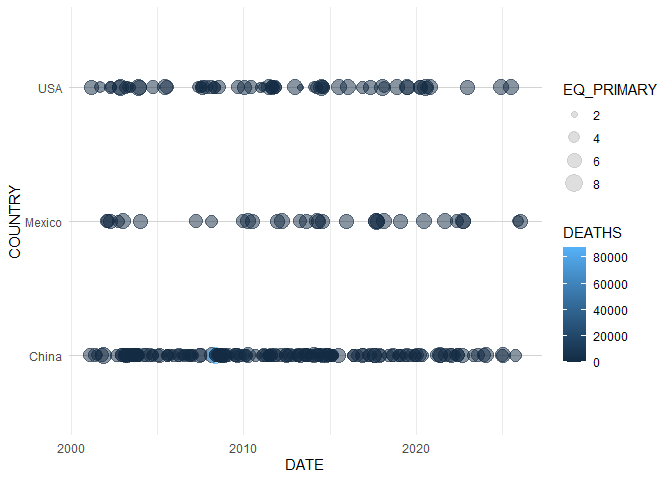
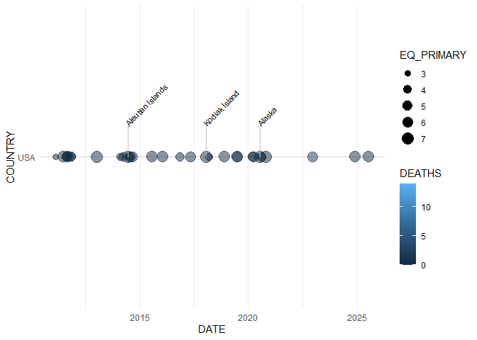

<!-- README.md is generated from README.Rmd. Please edit that file -->

# noaaquakes

The noaaquakes package provides a suite of tools for reading, cleaning,
and visualizing the NOAA Significant Earthquake Database. It includes
specialized ggplot2 geometries for timelines and leaflet wrappers for
interactive mapping.

<!-- badges: start -->

<!-- badges: end -->

## Installation

You can install the development version of noaaquakes from
[GitHub](https://github.com/) with:

``` r
# install.packages("pak")
pak::pak("derneld/noaaquakes")
```

## Data Preparation

The package provides functions to import the raw NOAA TSV file and
convert it into a tidy format suitable for analysis.

``` r
library(noaaquakes)
library(dplyr)
#> 
#> Attaching package: 'dplyr'
#> The following objects are masked from 'package:stats':
#> 
#>     filter, lag
#> The following objects are masked from 'package:base':
#> 
#>     intersect, setdiff, setequal, union

# Find the correct path regardless of whether the package is installed or in development
file_path <- system.file("extdata", "earthquakes.tsv", package = "noaaquakes")

# If system.file returns empty (package not installed yet), point to the local file
if (file_path == "") {
  file_path <- "inst/extdata/earthquakes.tsv"
}

raw_data <- eq_read_data(file_path)
#> Rows: 6663 Columns: 39
#> ── Column specification ────────────────────────────────────────────────────────
#> Delimiter: "\t"
#> chr  (2): Search Parameters, Location Name
#> dbl (37): Year, Mo, Dy, Hr, Mn, Sec, Tsu, Vol, Latitude, Longitude, Focal De...
#> 
#> ℹ Use `spec()` to retrieve the full column specification for this data.
#> ℹ Specify the column types or set `show_col_types = FALSE` to quiet this message.
clean_data <- eq_clean_data(raw_data)
```

## Visualizing Regional Earthquake Activity

The package introduces geom_timeline() to plot earthquakes on a
horizontal time axis, with the ability to stratify by region (y-axis)
and scale by magnitude or deaths.

``` r
library(ggplot2)

clean_data %>%
  filter(COUNTRY %in% c("USA", "China", "Mexico"), Year > 2000) %>%
  ggplot(aes(x = DATE, y = COUNTRY, color = DEATHS, size = EQ_PRIMARY)) +
  geom_timeline() +
  theme_minimal()
```



### Adding Labels

You can use geom_timeline_label() to highlight the most significant
events by magnitude.

``` r
clean_data %>%
  filter(COUNTRY == "USA", Year > 2010) %>%
  ggplot(aes(x = DATE, y = COUNTRY, color = DEATHS, size = EQ_PRIMARY)) +
  geom_timeline() +
  geom_timeline_label(aes(label = LOCATION_NAME, magnitude = EQ_PRIMARY), n_max = 3) +
  theme_minimal()
```



## Interactive Maps

The eq_map() function leverages leaflet to create interactive
visualizations. You can generate custom HTML labels using
eq_create_label() to show detailed information in pop-ups.

``` r
clean_data %>%
  filter(COUNTRY == "Mexico" & Year > 2010) %>%
  mutate(popup_text = eq_create_label(.)) %>%
  eq_map(annot_col = "popup_text")
```

<div class="leaflet html-widget html-fill-item" id="htmlwidget-c79a723a1045747fdde0" style="width:100%;height:480px;"></div>
<script type="application/json" data-for="htmlwidget-c79a723a1045747fdde0">{"x":{"options":{"crs":{"crsClass":"L.CRS.EPSG3857","code":null,"proj4def":null,"projectedBounds":null,"options":{}}},"calls":[{"method":"addTiles","args":["https://{s}.tile.openstreetmap.org/{z}/{x}/{y}.png",null,null,{"minZoom":0,"maxZoom":18,"tileSize":256,"subdomains":"abc","errorTileUrl":"","tms":false,"noWrap":false,"zoomOffset":0,"zoomReverse":false,"opacity":1,"zIndex":1,"detectRetina":false,"attribution":"&copy; <a href=\"https://openstreetmap.org/copyright/\">OpenStreetMap<\/a>,  <a href=\"https://opendatacommons.org/licenses/odbl/\">ODbL<\/a>"}]},{"method":"addCircleMarkers","args":[[17.844,16.493,18.081,16.878,17.397,17.235,17.682,15.802,15.022,18.55,16.626,16.386,14.68,15.886,16.982,16.169,18.455,18.263,15.789,16.902],[-99.96299999999999,-98.23099999999999,-102.182,-99.498,-100.972,-100.746,-95.65300000000001,-93.633,-93.899,-98.489,-95.078,-97.979,-92.453,-96.008,-99.773,-95.958,-102.956,-102.955,-95.05500000000001,-99.303],[6.4,7.4,6,6.2,7.2,6.4,6.3,6.6,8.199999999999999,7.1,6.1,7.2,6.7,7.4,7,5.5,7.6,6.8,4.1,6.5],null,null,{"interactive":true,"className":"","stroke":true,"color":"#03F","weight":1,"opacity":0.5,"fill":true,"fillColor":"#03F","fillOpacity":0.4},null,null,["<b>Location:<\/b> Guerrero<br/><b>Magnitude:<\/b> 6.4<br/><b>Total deaths:<\/b>   2<br/>","<b>Location:<\/b> Guerrero, Oaxaca<br/><b>Magnitude:<\/b> 7.4<br/><b>Total deaths:<\/b>   2<br/>","<b>Location:<\/b> Lazaro Cardenas<br/><b>Magnitude:<\/b> 6.0<br/><b>Total deaths:<\/b>   0<br/>","<b>Location:<\/b> San Marcos, Acapulco<br/><b>Magnitude:<\/b> 6.2<br/><b>Total deaths:<\/b>   0<br/>","<b>Location:<\/b> Guerrero; Mexico City<br/><b>Magnitude:<\/b> 7.2<br/><b>Total deaths:<\/b>   0<br/>","<b>Location:<\/b> Tecpan<br/><b>Magnitude:<\/b> 6.4<br/><b>Total deaths:<\/b>   0<br/>","<b>Location:<\/b> Oaxaca<br/><b>Magnitude:<\/b> 6.3<br/><b>Total deaths:<\/b>   1<br/>","<b>Location:<\/b> Cocotitlan<br/><b>Magnitude:<\/b> 6.6<br/><b>Total deaths:<\/b>   2<br/>","<b>Location:<\/b> Oaxaca, Chiapas, Tabasco; Guatemala<br/><b>Magnitude:<\/b> 8.2<br/><b>Total deaths:<\/b>  98<br/>","<b>Location:<\/b> Mexico City, Morelos, Puebla<br/><b>Magnitude:<\/b> 7.1<br/><b>Total deaths:<\/b> 369<br/>","<b>Location:<\/b> Oaxaca<br/><b>Magnitude:<\/b> 6.1<br/><b>Total deaths:<\/b>   5<br/>","<b>Location:<\/b> Oaxaca<br/><b>Magnitude:<\/b> 7.2<br/><b>Total deaths:<\/b>  14<br/>","<b>Location:<\/b> San Marcos<br/><b>Magnitude:<\/b> 6.7<br/><b>Total deaths:<\/b>   0<br/>","<b>Location:<\/b> Oaxaca<br/><b>Magnitude:<\/b> 7.4<br/><b>Total deaths:<\/b>  10<br/>","<b>Location:<\/b> Guerrero<br/><b>Magnitude:<\/b> 7.0<br/><b>Total deaths:<\/b>   3<br/>","<b>Location:<\/b> Oaxaca<br/><b>Magnitude:<\/b> 5.5<br/><b>Total deaths:<\/b>   0<br/>","<b>Location:<\/b> Michoacan, Colima, Jalisco<br/><b>Magnitude:<\/b> 7.6<br/><b>Total deaths:<\/b>   2<br/>","<b>Location:<\/b> Mexico City, Michoacan<br/><b>Magnitude:<\/b> 6.8<br/><b>Total deaths:<\/b>   3<br/>","<b>Location:<\/b> Oaxaca<br/><b>Magnitude:<\/b> 4.1<br/><b>Total deaths:<\/b>   0<br/>","<b>Location:<\/b> Guerrero<br/><b>Magnitude:<\/b> 6.5<br/><b>Total deaths:<\/b>   2<br/>"],null,null,{"interactive":false,"permanent":false,"direction":"auto","opacity":1,"offset":[0,0],"textsize":"10px","textOnly":false,"className":"","sticky":true},null]}],"limits":{"lat":[14.68,18.55],"lng":[-102.956,-92.453]}},"evals":[],"jsHooks":[]}</script>
