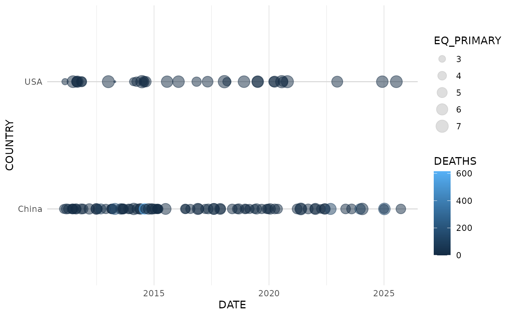
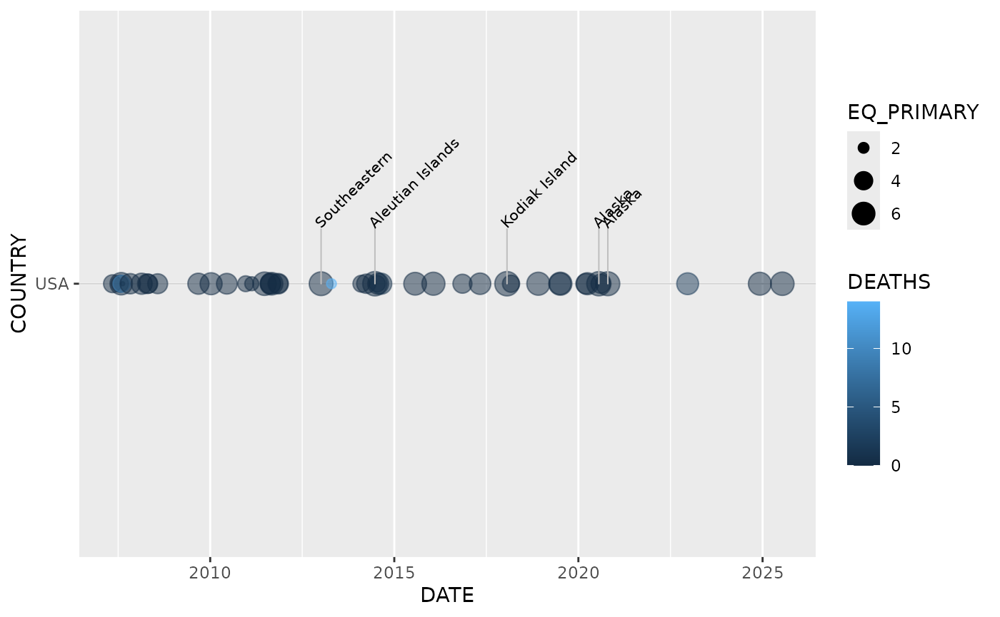

# Introduction to noaaquakes

``` r
library(noaaquakes)
library(ggplot2)
library(dplyr)
#> 
#> Attaching package: 'dplyr'
#> The following objects are masked from 'package:stats':
#> 
#>     filter, lag
#> The following objects are masked from 'package:base':
#> 
#>     intersect, setdiff, setequal, union
library(lubridate)
#> 
#> Attaching package: 'lubridate'
#> The following objects are masked from 'package:base':
#> 
#>     date, intersect, setdiff, union
```

The noaaquakes package is designed to help researchers and data
scientists process and visualize the NOAA Significant Earthquake
Database. It handles the cleaning of raw data and provides specialized
tools for temporal and spatial visualization.

## Data Processing

First, we load the raw data and clean it. In this example, we assume you
have the NOAA dataset saved locally.

``` r
# Locate the data within the package installation
filename <- system.file("extdata", "earthquakes.tsv", package = "noaaquakes")

# Read and clean the data
# Note: eq_clean_data handles the date conversion and location cleaning
data <- readr::read_tsv(filename) %>% 
  eq_clean_data()
#> Rows: 6663 Columns: 39
#> ── Column specification ────────────────────────────────────────────────────────
#> Delimiter: "\t"
#> chr  (2): Search Parameters, Location Name
#> dbl (37): Year, Mo, Dy, Hr, Mn, Sec, Tsu, Vol, Latitude, Longitude, Focal De...
#> 
#> ℹ Use `spec()` to retrieve the full column specification for this data.
#> ℹ Specify the column types or set `show_col_types = FALSE` to quiet this message.

# Preview the cleaned data
head(data %>% select(DATE, COUNTRY, LOCATION_NAME, EQ_PRIMARY))
#> # A tibble: 6 × 4
#>   DATE        COUNTRY      LOCATION_NAME        EQ_PRIMARY
#>   <date>      <chr>        <chr>                     <dbl>
#> 1 -2150-01-01 Jordan       Bab-A-Daraa,Al-Karak        7.3
#> 2 -2000-01-01 Turkmenistan W                           7.1
#> 3 -1250-01-01 Israel       Ariha (Jericho)             6.5
#> 4 -1050-01-01 Jordan       Timna Copper Mines          6.2
#> 5 -479-01-01  Greece       Macedonia                   7  
#> 6 -426-06-01  Greece       Euboea                      7.1
```

### Internal Helpers

Note that eq_location_clean() and clean_usa_names() are internal helper
functions used by the cleaning pipeline and are not exported for direct
user use.

## Visualizing Timelines with geom_timeline

The geom_timeline() function allows you to plot earthquakes along a
horizontal time axis. You can compare different countries by mapping
them to the y aesthetic.

``` r
# Example: Visualizing major earthquakes in China and USA since 2010
data %>%
  filter(COUNTRY %in% c("USA", "China"), Year > 2010) %>%
  ggplot(aes(x = DATE, 
             y = COUNTRY, 
             size = EQ_PRIMARY, 
             color = DEATHS)) +
  geom_timeline() +
  theme_minimal()
```



### Adding Labels

To identify specific events, use geom_timeline_label(). This adds a
vertical line and a 45-degree rotated label for the top n_max
earthquakes by magnitude.

``` r
data %>%
  filter(COUNTRY == "USA", Year > 2005) %>%
  ggplot(aes(x = DATE, y = COUNTRY, size = EQ_PRIMARY, color = DEATHS)) +
  geom_timeline() +
  geom_timeline_label(aes(label = LOCATION_NAME, magnitude = EQ_PRIMARY), n_max = 5)
```



## Interactive Mapping

For spatial analysis, noaaquakes provides a wrapper around the leaflet
package.

1.  eq_map(): Draws the map with circle markers where the radius
    corresponds to the earthquake’s magnitude.
2.  eq_create_label(): Generates high-quality HTML labels showing the
    Location, Magnitude, and Total Deaths for map pop-ups.

``` r
data %>%
  filter(COUNTRY == "Mexico", Year > 2015) %>%
  mutate(popup_text = eq_create_label(.)) %>%
  eq_map(annot_col = "popup_text")
```
